# Introduction
Dans ce tutoriel, nous allons vous guider pas à pas dans la création d'une application web en réalité augmentée (AR) simple. 


L'objectif est de voir ensemble toute la chaine technique qui permet à un projet d'exister en tant que page web. Nous verrons aussi comment écrire des informations sur des puces RFID.

Nous utiliserons A-Frame, un framework web open-source pour créer des expériences VR/AR, et AR.js, une bibliothèque JavaScript qui permet d'intégrer des fonctionnalités AR dans les applications web. 

Notre objectif sera d'afficher le texte "Hello" sur un marqueur AR de type code-barres. Puis de customiser le contenu.

Ce petit projet comprend aussi la réalisation d'une "étiquette" / "porte clé".
<div align="center">
  
  
</div>

Nous allons utiliser différents outils gratuits :
- github : pour versionner votre code et hébérger gratuitement votre projet.
- projectIDX : qui est un IDE (integrated development environment) qui permet d'écrire du code et qui se connecte à github pour hierarchiser les changements dans notre code.
- nfctools : qui est une application pour android ou iOS et qui nous permettra d'écrire de l'information sur notre sticker RFID.

# Prérequis
- Un ordinateur
- Un éditeur de code notre outil sera : [projectIDX](https://idx.dev/)
- Un navigateur web (Chrome, Firefox ...)
- Un smartphone avec un navigateur web (Chrome, Firefox ...)

- avoir un compte Github
- avoir un compte Gmail


# Matériel à votre disposition
- un petit carré de carton bois au bords arrondis
- un sticker découpé sur vynile mat
- un petit cordon métallique avec une attache
- une petite puce rfid

<div align="center"> 
  
</div>

Pour l'assemblage, rien de plus simple :
- coller le sticker sur le carré en carton bois sur l'emplacement délimité par la gravure.
- coller la puce RFID, centrée, au dos de ce carré.
- dévisser l'attache et faite la passer dans le trou.

et voilà ! on est prêts à passer sur la partie numérique !

Si vous voulez plus d'infos sur cette partie là
- [Explications de la découpe stickers](https://github.com/LucieMrc/SilhouetteCameo_2spi)
- [Explications sur la découpe laser](https://github.com/b2renger/Introduction_Laser_Beambox)

# Étape 1 : Créer un compte GitHub et un dépôt
- Créer un compte GitHub : Si vous n'en avez pas déjà un, rendez-vous sur https://github.com/signup?source=login et créez un compte.

**☢️ Le nom d'utilisateur que vous choisissez sera utilisé pour l'adresse qu'il faudra tapper pour voir votre projet. <u>Choisissez un nom court ! sans espaces, sans caractères spéciaux (accents etc.)</u>**

<div align="center"> 
  
  
</div>

- Créer un nouveau dépôt : Une fois connecté, cliquez sur le bouton "New repository". Donnez un nom à votre dépôt (par exemple, "microProjetAr"), ajoutez une description facultative, et cliquez sur "Create repository".

<div align="center"> 

</div>
</br>
<div align="center"> 

</div>


# Étape 2 : Activer GitHub Pages
Nous allons maintenant configurer GitHub Pages, pour permettre à notre projet d'être servi par les serveurs de github lorsque l'on rentre l'adresse : https://[votre-nom-utilisateur].github.io/[votre-depot]


- Accéder aux paramètres : Dans votre dépôt, cliquez sur l'onglet "Settings", puis sur l'onglet "Pages"

<div align="center"> 

</div>
</br>
<div align="center"> 

</div>

- Sélectionner la branche : Dans la section "GitHub Pages", sélectionnez la branche main (ou la branche principale de votre dépôt).
- Enregistrer les modifications : Cliquez sur le bouton "Save". Votre site GitHub Pages sera maintenant accessible à l'adresse https://[votre-nom-utilisateur].github.io/[microprojetAr].

<div align="center"> 

</div>

Si vous revenez sur la page d'accueil de votre projet, vous remarquerez au bout de quelques minutes, que certains éléments ont changé. Un déploiement est maintenant disponible !

<div align="center"> 

</div>

Toute l'infrastructure nécessaire pour héberger votre projet est donc bien en place, il suffit maintenant d'ajouter du contenu.


# Étape 3 : Utiliser Project IDX

Rendez-vous sur le site de [projetIDX](https://idx.dev/) et connectez-vous.

Importer le dépôt : Utilisez l'option pour importer votre dépôt GitHub dans Project IDX.

<div align="center"> 

</div>

Copiez l'adresse du dépot créé précédement.
<div align="center"> 

</div>

Configurer le projet pour un usage de developpement web.

- Créer un dossier ".idx":
  <div align="center"> 
  
  </div>

- Dans ce dossier, créer un fichier nommé "dev.nix"
  <div align="center"> 
  
  </div>
  Pour arriver à ce résultat :
   <div align="center"> 
  
  </div>

- Copier le code de configuration de l'environnement de developpement dans le fichier "dev.nix" que vous venez de créer. (Ce fichier va nous permettre de tester notre code directement dans projetIDX et aussi de tester sur notre téléphone).
  ```
    # To learn more about how to use Nix to configure your environment
  # see: https://developers.google.com/idx/guides/customize-idx-env
  { pkgs, ... }: {
    # Which nixpkgs channel to use.
    channel = "stable-23.11"; # or "unstable"
    # Use https://search.nixos.org/packages to find packages
    packages = [
      pkgs.nodejs_20
      pkgs.python3
    ];
    # Sets environment variables in the workspace
    env = {};
    idx = {
      # Search for the extensions you want on https://open-vsx.org/ and use   "publisher.id"
      extensions = [
        # "vscodevim.vim"
      ];
      # Enable previews and customize configuration
      previews = {
        enable = true;
        previews = {
          web = {
            command = ["python3" "-m" "http.server" "$PORT" "--bind" "0.0.0.0"];
            manager = "web";
          };
        };
      };
      # Workspace lifecycle hooks
      workspace = {
        # Runs when a workspace is first created
        onCreate = {
          # Example: install JS dependencies from NPM
          # npm-install = "npm install";
          # Open editors for the following files by default, if they exist:
          default.openFiles = [ "style.css" "main.js" "index.html" ];
        };
        # Runs when the workspace is (re)started
        onStart = {
          # Example: start a background task to watch and re-build backend code
          # watch-backend = "npm run watch-backend";
        };
      };
    };
  }
  ```
Votre environnement de travail devrait ressembler à ceci :
   
  <div align="center"> 
  
  </div>

Il ne vous reste plus qu'à cliquer sur le bouton "Rebuild Environment" et c'est bon !


# Étape 4 : Créer la page HTML

Créer un fichier index.html : Dans votre projet IDX, créez un fichier nommé **"index.html."**

<div align="center"> 
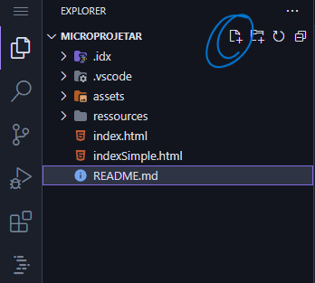
</div>


Ajouter le code HTML : Copiez et collez le code HTML suivant dans votre fichier index.html :

```HTML
<!DOCTYPE html>
<html>
<head>
  <title>Ma première app AR</title>
  <script src="https://aframe.io/releases/1.3.0/aframe.min.js"></script>
  <script src="https://raw.githubusercontent.com/jeromeetienne/AR.js/master/aframe/build/aframe-ar.js"></script>   

</head>
<body>
    <a-scene embedded
    arjs="sourceType: webcam; detectionMode: mono_and_matrix; matrixCodeType: 3x3; trackingMethod: best ; changeMatrixMode: modelViewMatrix;"
    renderer="sortObjects: true; antialias: true; colorManagement: true; physicallyCorrectLights; logarithmicDepthBuffer: true;"

    vr-mode-ui="enabled: false"

    smooth=" true" smoothCount="5" smoothTolerance=".05" smoothThreshold="5"
    
    sourceWidth="800" sourceHeight="600" displayWidth="1280" displayHeight="720">

      
        <a-marker type='barcode' value='2'>
   
            <a-text value="Hello !" 
            side="double" position = "0 0 -1" rotation="270 0 0" 
            width="8"
            color="red" align="center" >
            </a-text>

        </a-marker>

        <a-entity camera></a-entity>
  </a-scene>
</body>
</html>
```


# Étape 5 : Comprendre le code
Ce code crée une expérience simple de réalité augmentée (RA) en utilisant A-Frame et AR.js. Décomposons ce que fait chaque partie :

Si vous n'êtes pas à l'aise et ne connaissez pas du tout la manière dont du code html fonctionne cliquez sur le petit triangle pour déplier une explication des bases de la syntaxe html

<details > <summary> <b>&#128161 les bases html</b> </summary>

Une page HTML est comme un sandwich. Elle a besoin d'un pain du haut et d'un pain du bas pour contenir la garniture !

Le pain du haut et du bas, ce sont les balises ```<html>``` et ```</html>```. Elles indiquent au navigateur que le contenu entre ces balises est du code HTML.

Deux parties principales : À l'intérieur du "sandwich HTML", on trouve deux parties :

**La tête** (```<head>``` et ```</head>```) : C'est comme les informations sur l'emballage du sandwich. On y met des informations importantes pour le navigateur, mais qui ne sont pas affichées directement à l'utilisateur. 

Par exemple :
- Le titre de la page ```<title>```

- Des liens vers des fichiers CSS pour le style

- Des liens vers des fichiers JavaScript pour les fonctionnalités interactives

**Le corps** (```<body>``` et ```</body>```) : C'est la garniture du sandwich ! C'est le contenu visible de la page web : texte, images, vidéos, etc.

La syntaxe et donc l'interprétation par le navigateur du code html repose sur des balises ouvrantes et fermantes :

- La balise **ouvrante** (par exemple ```<p>```)  dit au navigateur : "Attention, on commence un paragraphe !"
- La balise fermante (par exemple ```</p>```) dit : "Voilà, le paragraphe est terminé."

Tout le contenu entre la balise ouvrante et la balise fermante est considéré comme faisant partie de cet élément.

Exemple :
```html
<html>
<head>
  <title>Ma page web</title>
</head>
<body>
  <h1>Bienvenue !</h1>
  <p>Ceci est un paragraphe de texte.</p>
</body>
</html>
```
Dans cet exemple :

- ```<html>``` ouvre la page HTML et ```</html>``` la ferme.
- ```<head>``` ouvre la section d'en-tête et ```</head>``` la ferme.
- ```<title>``` ouvre le titre de la page et ```</title>``` le ferme.
- ```<body>``` ouvre le corps de la page et ```</body>``` le ferme.
- ```<h1>``` ouvre un titre de niveau 1 et ```</h1>``` le ferme.
- ```<p>``` ouvre un paragraphe et ```</p>``` le ferme.

</details>
</br>

Ici nous avons une structure HTML classique : Le code met en place une page HTML basique avec les sections <head> et <body>.


Dans la partie ```<head>```, nous ajoutons : 

- le titre de l'expérience
  ```html
  <title>Ma première app AR</title>
  ```

- la *Bibliothèque A-Frame* : Il inclut la bibliothèque A-Frame (aframe.min.js) qui est un framework JavaScript permettant de créer des expériences de réalité virtuelle (RV) et de RA en utilisant du HTML.
  ```html
  <script src="https://aframe.io/releases/1.3.0/aframe.min.js"></script>
  ``` 

- la *Bibliothèque AR.js* : Il inclut la bibliothèque AR.js (aframe-ar.js) qui ajoute des capacités de RA à A-Frame.
  ```html
  <script src="https://raw.githubusercontent.com/jeromeetienne/AR.js/master/aframe/build/aframe-ar.js"></script>  
  ```

Dans la partie ```<body>```, et c'est ici que tout ce joue pour le contenu visible par l'utilisateur. Nous ajoutons : 

- la *scène RA* : L'élément ```<a-scene>``` crée la scène de RA.
  ```html
  <a-scene embedded
    arjs="sourceType: webcam; detectionMode: mono_and_matrix; matrixCodeType: 3x3; trackingMethod: best ; changeMatrixMode: modelViewMatrix;"
    renderer="sortObjects: true; antialias: true; colorManagement: true; physicallyCorrectLights; logarithmicDepthBuffer: true;"

    vr-mode-ui="enabled: false"

    smooth=" true" smoothCount="5" smoothTolerance=".05" smoothThreshold="5"
    
    sourceWidth="800" sourceHeight="600" displayWidth="1280" displayHeight="720">

        <!-- contenu de l'expérience AR avec d'autres balises -->

  </a-scene>
  ```
  Remarquez qu'avant le chevron fermant '>' de la balise ```<a-scene>``` nous ajoutons beaucoup d'options (qui s'appellent attributs en html)  pour configuer la manière dont la scène va s'afficher.

  <details > <summary> <b>&#128161 les détails des options de configuration de l'attribut arjs</b> </summary>
  - *embedded* : Cet attribut indique à A-Frame d'intégrer la scène dans la page HTML.

  - *arjs* : Cet attribut configure AR.js 
    - *sourceType: webcam* : Utilise la webcam de l'appareil comme source vidéo.
    - *detectionMode: mono_and_matrix* : Détecte à la fois les images cibles et les marqueurs de type code-barres.
    - *matrixCodeType: 3x3* : Spécifie que le type de code-barres utilisé est un code-barres matriciel 3x3.
    - *trackingMethod: best* : Utilise la meilleure méthode de suivi disponible.
    - *changeMatrixMode: modelViewMatrix* : Mode de changement de matrice pour le suivi.
    - *vr-mode-ui="enabled: false"* : Désactive l'interface utilisateur du mode VR.
    - *renderer*. Configure le rendu de la scène avec des options pour le tri des objets, l'antialiasing, la gestion des couleurs, etc.
    - *smooth* : Active le lissage du mouvement de la caméra.
  </details>
  </br>

- Le *marqueur* : L'élément ```<a-marker>``` définit un marqueur de type code-barres avec la valeur '2'. Lorsque la caméra détecte ce marqueur, le contenu à l'intérieur de la balise sera affiché en RA.
  ```html
  <a-marker type='barcode' value='2'>
    <!-- ajouter du contenu qui sera visible par l'utilisateur et donc ancré sur notre marqueur -->
  </a-marker>
  ```
  Ici la valeur 2 correspond à un motif précis qui a été prédécoupé pour vous à la [découpeuse de stickers](https://github.com/LucieMrc/SilhouetteCameo_2spi). Avec la technique que nous utilisons [il existe 64 motifs différents](https://github.com/b2renger/Introduction_A-frame/blob/main/markers/barcodes/2.png) qui peuvent être détectés en même temps par arjs.

- Un texte : L'élément <a-text> crée un texte en 3D qui sera affiché au-dessus du marqueur. Le texte est "Hello !", de couleur rouge et centré.
  ```html
  <a-text value="Hello !" 
            side="double" position = "0 0 -1" rotation="270 0 0" 
            width="8"
            color="red" align="center" >
  </a-text>
  ```
    <details > <summary> <b>&#128161 les détails des attributs de la balise a-text</b> </summary>
  - *value* : Le texte à afficher.
  - *side=double* : permet d'afficher le texte quelque soit l'angle sous lequel on le regarde.
  - *position="0 0 -1" : la position xyz du centre du texte par rapport au centre du marqueur.
  - *rotation="270 0 0"* :
  - *width="8"* : la largeur du texte.
  - *color="red"* : la couleur du texte.
  - *align="center"* : l'alignement du texte.
  </details>
  </br>

- Caméra : L'élément ```<a-entity camera>``` définit la caméra de la scène, le fonctionnement par défaut nous convient parfaitement, mais il est possible d'ajouter des fonctionalités comme par exemple l'interaction via l'orientation du regard ('gaze' interaction).


En résumé, ce code crée une expérience de RA où un texte apparaît dans un esapce 3D lorsque le marqueur code-barres 2 est détecté par la caméra.


# Étape 6 : Tester
- Configurer

- Enregistrer les modifications : Enregistrez votre fichier index.html.

- Tester votre projet : Affichez la webview de votre projet.

  <div align="center"> 
  
  </div>

  **☣️** Il peut arriver que la webview disparaisse ... Dans ce cas là vous pouvez faire apparaitre la "palette de commande" en (Cmd+Maj+P sur Mac ou Ctrl+Maj+P pour les autres systèmes), puis sélectionnez ou tappez "Show Web Preview" (Afficher l'aperçu sur le Web).


  <div align="center"> 
  
  </div>

  Vous pouvez alors visionner votre page en plein écran en cliquant sur le petit icône en haut à droite.

  <div align="center"> 
  
  </div>

  Cela ouvrira votre expérience dans un nouvel onglet sur votre ordinateur. A ce stade vous devriez voir : une page web vous montrant vous !

  Si vous montrez le marqueur à la caméra vous devriez voir ceci :

  <div align="center"> 
  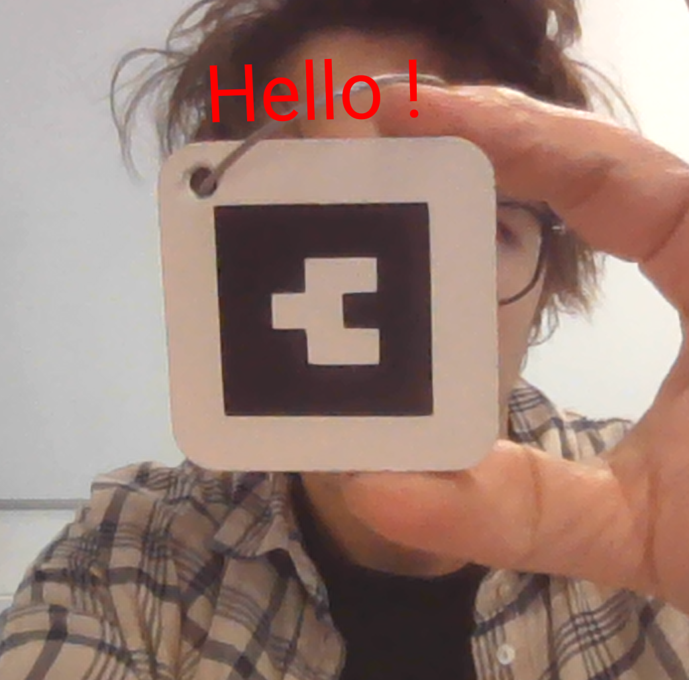
  </div>

  Votre projet fonctionne donc dans l'éditeur et avec la caméra de votre ordinateur.

  Vous pouvez maintenant le tester sur votre smartphone. Il vous suffit de vous rendre sur la page que vous venez d'ouvrir.

  Si vous utilisez chrome, vous pouvez aussi créer un QR code que vous pourrez scanner avec votre appareil photo pour accéder à la page de test.

  <div align="center"> 
  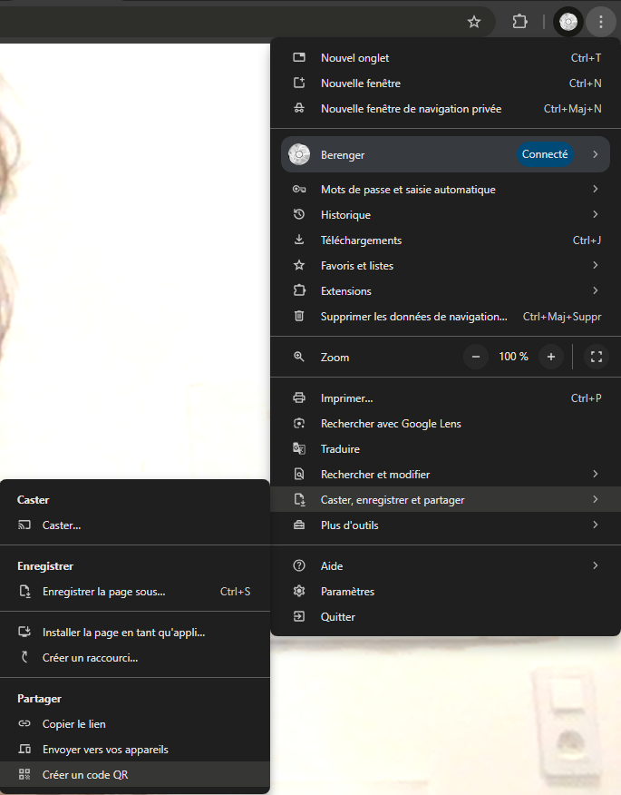
  </div>

  
Vous pouvez ensuite répéter ces opérations en changeant le code, sauvegardant et en actualisant la page. 

Essayer par exemple de changer le texte, sa couleur, sa taille, sa position etc.


# Étape 7 : Publier l'application

Commiter les modifications : Utilisez les outils de versioning de Project IDX pour commiter vos changements et les pousser sur votre dépôt GitHub.

- Cliquer sur le bouton source control de projetIDX
  <div align="center"> 
  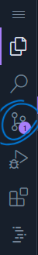
  </div>

- 'Stager' les changements en cliquant sur le "+"
  <div align="center"> 
  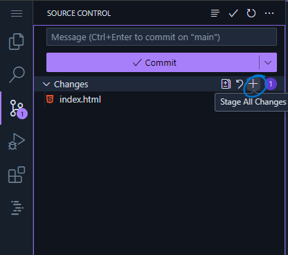
  </div>

- 'Commiter' les changements en cliquant sur le bouton 'commit'
  <div align="center"> 
  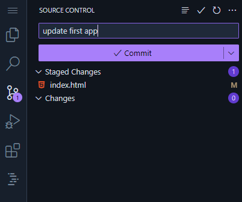
  </div>

- Synchroniser les changements en cliquant sur le bouton 'commit'
  <div align="center"> 
  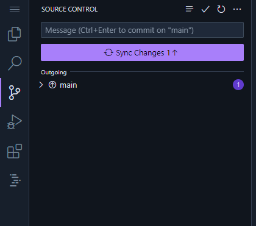
  </div>

Cette dernière opération va envoyer vos changements à votre dépot github et du coup mettre à jour la page mise en ligne.

**Votre expérience est maintenant déployée à l'adresse :** *https://[votre-nom-utilisateur].github.io/[votre-depot]*

**✨	 Félicitations ! ✨**  Vous avez créé votre première application AR. Vous pouvez maintenant personnaliser votre application en modifiant le texte, en ajoutant des modèles 3D, et en expérimentant avec différentes fonctionnalités d'A-Frame et AR.js.

Note : Ce tutoriel est une introduction de base. Pour approfondir vos connaissances, consultez la documentation officielle d'A-Frame et AR.js.

 #  Étape 8 : Encoder le sticker RFID

Notre but est de programmer notre sticker RFID pour que lorsque nous approchons notre téléphone, celui-ci va nous proposer d'ouvrir la page web hébergeant notre projet.

Pour cela nous allons utiliser NFCTools qui est gratuit et qui est disponible pour [Android](https://play.google.com/store/apps/details?id=com.wakdev.wdnfc&hl=fr) ou [iOS](https://apps.apple.com/fr/app/nfc-tools/id1252962749)?.

- Choisir l'onglet "Ecrire" et sélectionner "ajouter un enregistrement"
  <div align="center"> 
  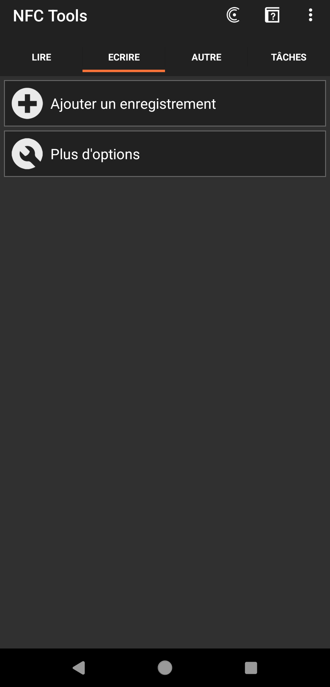
  </div>
- Choisir "URL/URI"
  <div align="center"> 
  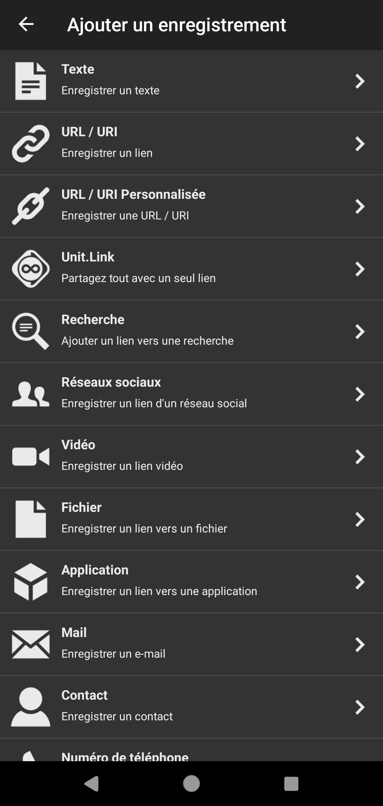
  </div>
- Entrer l'adresse de votre page puis valider
  <div align="center"> 
  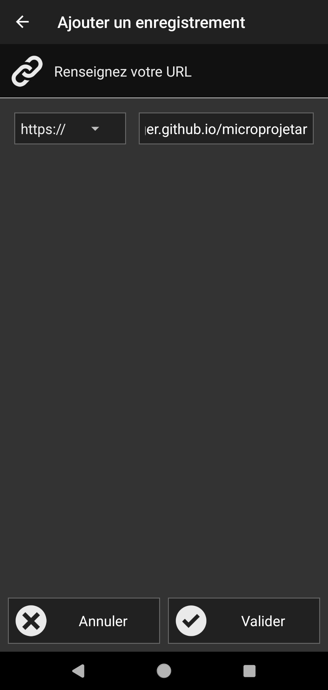
  </div>
- Vous pouvez maintenant cliquer sur le bouton "Ecrire" sous le champ "Plus d'options"
  <div align="center"> 
  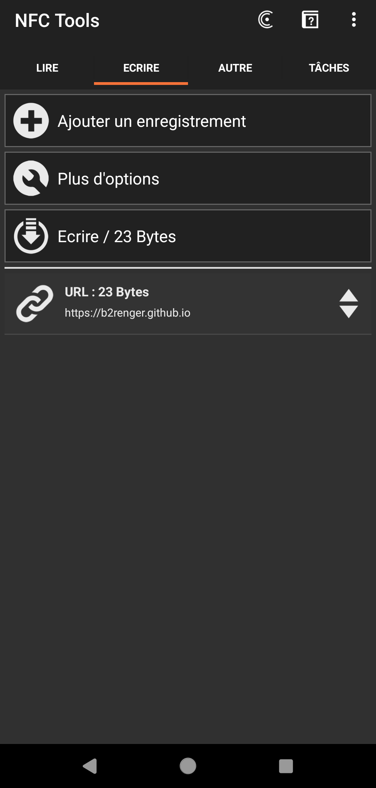
  </div>
- Vous devrier voir cet écran vous demandant d'approcher votre smartphone du sticker.
  <div align="center"> 
  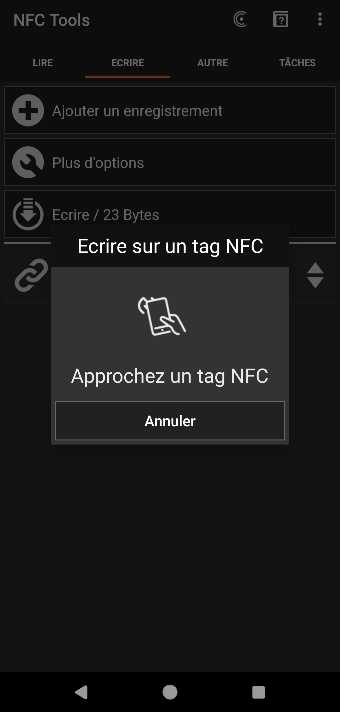
  </div>
- Une fois que vous avez réussi à détecter votre sticker, l'écriture devrait s'effectuer
  <div align="center"> 
  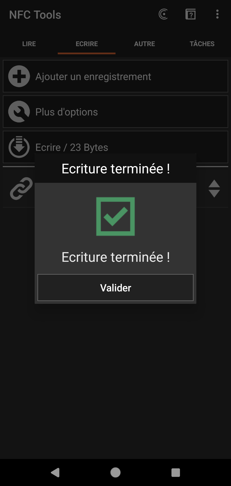
  </div>

Normalement c'est bon !
Vous pouvez fermer NFCTools et tester !


# Pour aller plus loin ...

Un cours entier en anglais est disponible sur [le site de l'ateliernum](http://ateliernum.github.io) à cette adresse : https://github.com/b2renger/Introduction_A-frame#introduction_a-frame

Personnaliser l'apparence : Ajouter d'autres éléments, modifier les couleurs, les tailles et les positions des éléments.

Ajouter des modèles 3D : Importer des modèles 3D dans votre scène.

Utiliser d'autres types de marqueurs : Explorer les différents types de marqueurs AR.

Créer des interactions : Ajouter des événements et des interactions à votre application.
